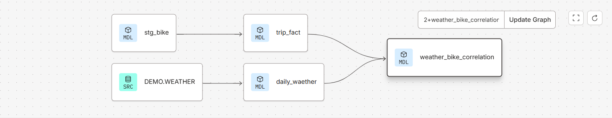

# Weather-bike-analytics


## Overview

Weather-bike-analytics is a hands-on analytics engineering project built with **dbt Core** and **Snowflake**. The project transforms raw weather and bike-sharing datasets into clean, analytics-ready models using a layered data modeling approach.

The objective was to practice dbt development by building reusable staging models, dimensional models, fact tables, tests, macros, and documentation while following dbt best practices.

---

## Tech Stack

- Snowflake
- dbt Core
- SQL
- Jinja
- Git & GitHub

---

## Project Architecture

```text
Raw Source Tables
        │
        ▼
 Source Definitions
        │
        ▼
  Staging Models
        │
        ├─────────────┐
        ▼             ▼
 Weather Data    Bike Trip Data
        │             │
        └──────┬──────┘
               ▼
 Fact & Dimension Models
               │
               ▼
 Business Analytics
```

---

## Project Structure

```text
models/
├── staging/
│   ├── stg_bike.sql
│   └── ...
│
├── marts/
│   ├── trip_fact.sql
│   ├── station_dimension.sql
│   ├── date_dimension.sql
│   ├── daily_weather.sql
│   └── weather_bike_correlation.sql
│
macros/
│   └── date_utils.sql
│
tests/
snapshots/
```

---

## Features

- Source definitions with documentation
- Modular staging models
- Fact and dimension modeling
- Weather and bike trip analytics
- Custom Jinja macros
- Schema tests
- Reusable SQL transformations
- dbt documentation support

---

## Data Flow

1. Load raw weather and bike-sharing data into Snowflake.
2. Standardize raw datasets using staging models.
3. Build dimension tables for reusable business entities.
4. Create fact tables for analytical reporting.
5. Combine weather and bike-trip data to study usage patterns and weather impact.

---

## Key Models

### `stg_bike`
Cleans and standardizes raw bike trip records before they are used downstream.

### `trip_fact`
Stores the primary bike trip metrics for analysis.

### `station_dimension`
Contains station attributes used across reports.

### `date_dimension`
Provides reusable calendar information for time-based reporting.

### `daily_weather`
Aggregates weather observations into daily metrics.

### `weather_bike_correlation`
Joins weather and bike usage data to analyze how weather conditions influence ridership.

---

## dbt Concepts Used

- Sources
- Models
- `ref()`
- Jinja
- Macros
- Schema YAML
- Tests
- Documentation

---

## Running the Project

```bash
dbt deps
dbt debug
dbt run
dbt test
dbt docs generate
dbt docs serve
```

---

## Screenshots

## dbt Lineage

The following graph shows the dependency between the models in this project.



## What I Learned

Working on this project helped me strengthen my understanding of:

- Data transformation using dbt
- Layered data modeling
- Fact and dimension design
- Writing reusable SQL models
- Creating custom macros
- Data quality testing
- Version control with Git

---

## Future Improvements

- Add incremental models where appropriate
- Implement CI/CD using GitHub Actions
- Add automated orchestration with Airflow
- Extend reporting models with additional KPIs

---

## Clone Repository

```bash
git clone https://github.com/Kiranachanta114/Weather-bike-analytics.git
cd DBT_DEMO
```

---

## Author

**Kiran Sai Pavan**

This project was developed as part of my learning journey in dbt and Snowflake, with an emphasis on building maintainable and well-structured data transformation pipelines.

